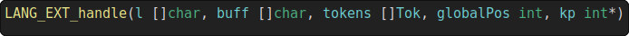

# bcat
This is a lightweight alternative to cat with syntax highlighting.

This program has been built on the [bah-snippets](https://github.com/ithirzty/bah-snippets) program, itself built on the [Bah's lexer](https://github.com/ithirzty/bah).

> Create your own color theme!

## Installing
Only available on linux for now.
```bash
git clone https://github.com/ithirzty/bcat
cd bcat
./install.sh
```

## Usage
Using bcat is as simple as it gets:
```bash
bcat file
```
Or with multiple files:
```bash
bcat file1 file2
```

## Changing the color theme
Go in the `~/.bcat` folder (**.bcat** folder in your home directory). There, you will find the `colors.cfg` file.

Inside it, you will be able to set the rgb values for each color. Note that you can comment a line with `#`.

## Contributing a new language
To add support for a new language, follow the steps below:
- create a bah file in the `languages/` folder,
- define a function `LANG_EXT_handle` where **EXT** is the file extension of the language,
- include the file in `main.bah`

### The `LANG_EXT_handle` function


#### Here are the required arguments:
- **l** `[]char`: the current line,
- **buff** `[]char`: the ascii formated line returned by your function,
- **tokens** `[]Tok`: the list of tokens returned by the Bah lexer,
- **globalPos** `int`: the current line offset position,
- **kp** `int*`: (optional) to keep in memory the current token index.